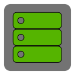

[[HOME|Home]] > [[TERASOLOGY LAUNCHER DOCUMENTATION|Documentation]]

The technical documentation of **TerasologyLauncher** aims to explain the used technologies and underlying concepts. We 
are trying to keep the hurdle for new contributors as low as possible.

Versioning
----------
This project uses "[Semantic Versioning][SemVer]" for specifying versions and build numbers. The version number is 
composed of three parts:

~~~
MAJOR.MINOR.PATCH
~~~
The `MAJOR` version is changed on breaking changes, e.g. when migrating from a Swing UI to JavaFX. The `MINOR` version
is increased when small feature enhancements or other non-breaking changes are introduced. The `PATCH` version indicates 
 patches and bug fixes which don't add functionality to the launcher. 
 
The current version is stored in the file `version.txt`.

We have a detailed guide on how to [[release a new version|create-new-release]]. 

Planned features for future versions and concrete milestone goals can be found under our [GitHub Milestones](https://github.com/MovingBlocks/TerasologyLauncher/milestones).

Building
--------
This section covers the build process of **TerasologyLauncher**. In general, we are using [Gradle](gradle.org) as build 
tool and [Jenkins](jenkins-ci.org) for CI.

### Gradle

### Jenkins
All Jenkins jobs regarding the launcher can be found under the [Jenkins Launcher View](http://jenkins.terasology.org/view/Launcher/).
We have set up automatic builds for [Nightly Builds](http://jenkins.terasology.org/view/Launcher/job/TerasologyLauncherNightly/), triggered by commits on GitHub.

Translations
------------
We attach great importance on the usabilty of the launcher - all over the world. Therefore, internationalization is a 
main goal for the development of **TerasologyLauncher**. We currently support 5 languages:
 
 - English
 - German
 - Spanish
 - Polish
 - Russian

Translation is very easy, you just have to translate a bunch of text snippets (labels, error messages, and so on). We've 
put up a guide on [[How to Add a New Translation|add-new-translation]]. Don't worry if you don't want to sign for GitHub
or deal with all the technical source code stuff, just drop by on the [forum](forum.terasology.org) or on IRC `#terasology` 
and contact us. 

Java Web Start
--------------

JavaFX
------

Launcher Updates
----------------

JavaDoc
-------

[SemVer]: http://semver.org/ "SemVer"